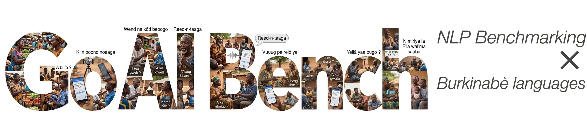

# GO AI Bench

<p align="center">
  
</p>

[](LICENSE)
[](https://python.org)
[](https://huggingface.co/spaces/goaicorp/goai-bench-leaderboard)
[](https://goaicorporation.org/)
[](https://huggingface.co/goaicorp)


Open benchmarking toolkit for evaluating NLP models on low-resource Burkinabè languages, developed by **GO AI Corporation**. Currently focuses on **Mooré** and **Dioula** across three evaluation tasks: **Machine Translation (MT)**, **Automatic Speech Recognition (ASR)**, and **Text-to-Speech (TTS)**. **Public rankings and results** are on the [GO AI Bench Leaderboard](https://huggingface.co/spaces/goaicorp/goai-bench-leaderboard) (Hugging Face Space).

If your question is not covered here or in the docs below, open a [GitHub issue](https://github.com/GO-AI-CORPORATION/goai-bench/issues) or reach us via [goaicorporation.org](https://goaicorporation.org/).

**Documentation** (detailed guides): **[English](docs/README.md)** — la même documentation est disponible **en français** sous [`docs/fr/`](docs/fr/) (voir l’index [docs/README.md](docs/README.md)).

## Table of Contents

- [Updates](#updates)
- [Supported Languages](#supported-languages)
- [Supported Tasks](#supported-tasks)
- [Architecture (overview)](#architecture-overview)
- [Setup](#setup)
- [Usage (quick examples)](#usage-quick-examples)
- [Python API](#python-api)
- [Roadmap](#roadmap)
- [Citation](#citation)
- [Acknowledgments](#acknowledgments)
- [License](#license)

---

<a name="updates"></a>

## Updates

- [04/2026] **Major update:** released **[GO AI Bench v0.1.0](https://github.com/GO-AI-CORPORATION/goai-bench)** (this toolkit) and **[GO AI Bench Leaderboard v0.1.0](https://huggingface.co/spaces/goaicorp/goai-bench-leaderboard)** — browse Mooré and Dioula results for ASR, TTS, and MT on the Space. [](https://huggingface.co/spaces/goaicorp/goai-bench-leaderboard)

---

## Supported Languages

| Language | ISO 639-3 | HF Code | Resource Level | MT | ASR | TTS |
|----------|-----------|---------|----------------|----|-----|-----|
| Moore | `mos` | `mos_Latn` | Low | Yes | Yes | Yes |
| Dioula | `dyu` | `dyu_Latn` | Low | Yes | Yes | Yes |

## Supported Tasks

| Task | Primary Metric | Baselines | Description |
|------|---------------|-----------|-------------|
| **MT** | chrF++ | NLLB-200 (3.3B, 1.3B, 600M) | Machine Translation (FR <-> target) |
| **ASR** | WER | Whisper, MMS | Automatic Speech Recognition |
| **TTS** | UTMOS | MMS-TTS | Text-to-Speech (naturalness + intelligibility) |

---

## Architecture (overview)

GO AI Bench wraps each model in a **provider** (`MTProvider`, `ASRProvider`, `TTSProvider`). YAML under `configs/datasets/` describes Hugging Face datasets and **benchmark groups**; `DataLoader` loads samples from the Hub; evaluators in `tasks/` compute metrics; `ResultWriter` saves JSON, summaries, and comparisons.

For a full diagram, package layout, and planned improvements, see **[docs/en/architecture.md](docs/en/architecture.md)** or **[docs/fr/architecture.md](docs/fr/architecture.md)**.

---

## Setup

```bash
git clone https://github.com/GO-AI-CORPORATION/goai-bench.git
cd goai-bench

python -m venv .venv
.venv\Scripts\activate       # Windows
pip install -e .

# Optional: TTS naturalness scoring
pip install git+https://github.com/sarulab-speech/UTMOSv2.git
```

### HuggingFace Token (required for gated datasets)

Create a `.env` file at the repo root:

```
HF_TOKEN=hf_your_token_here
```

Or set the environment variable:

```bash
export HF_TOKEN=hf_your_token_here
```

---

## Usage (quick examples)

By default the CLI evaluates **all benchmark groups** in `configs/datasets/<language>.yaml` (model loaded once). Full CLI options, output layout, `compare_results.py`, and `run_baselines.py` are documented in **[docs/en/benchmarking.md](docs/en/benchmarking.md)** / **[docs/fr/benchmarking.md](docs/fr/benchmarking.md)**.

**MT** (French → Mooré, all groups):

```bash
python scripts/run_benchmark.py --task mt --language mos_Latn \
  --model facebook/nllb-200-distilled-600M --no-comet --verbose
```

**ASR** (Mooré):

```bash
python scripts/run_benchmark.py --task asr --language mos_Latn \
  --model openai/whisper-large-v3 --verbose
```

**TTS** (Mooré):

```bash
python scripts/run_benchmark.py --task tts --language mos_Latn \
  --model facebook/mms-tts-mos --verbose
```

After install, you can use `goai-bench` instead of `python scripts/run_benchmark.py`.

**More topics:** [datasets](docs/en/datasets.md) · [adding a language](docs/en/languages.md) · [custom providers](docs/en/providers.md) · [model inventory (Hub links)](docs/en/model-inventory.md) — versions FR : [jeux de données](docs/fr/datasets.md) · [langues](docs/fr/languages.md) · [providers](docs/fr/providers.md) · [inventaire modèles](docs/fr/model-inventory.md).

---

## Python API

```python
from goai_bench.core.config_loader import ConfigLoader
from goai_bench.core.data_loader import DataLoader
from goai_bench.providers.factory import create_mt_provider
from goai_bench.tasks.mt import MTEvaluator

cfg = ConfigLoader()
loader = DataLoader()

source_cfg = cfg.get_dataset_source("mos_Latn", "mt")
data = loader.load_from_config(source_cfg, "mt", split="test")

provider = create_mt_provider("facebook/nllb-200-distilled-600M")
evaluator = MTEvaluator(provider, "fra_Latn", "mos_Latn")
result = evaluator.evaluate(data, compute_comet=False)
print(f"chrF++: {result.overall_chrf:.1f}")
print(f"BLEU:   {result.overall_bleu:.1f}")
```

---

## Roadmap

- **Proprietary API providers** -- interfaces for commercial MT/ASR/TTS APIs (Google, Azure, OpenAI) so they can be benchmarked alongside open models.
- **Local dataset support** -- re-enable benchmarking from local TSV/audio files for offline or private datasets.
- **Additional Burkinabe languages** -- Fulfulde, Gourmantchema, Bissa, Lobiri, and other national languages.
- **Hugging Face Spaces leaderboard** -- evolve the interactive dashboard ([goai-bench-leaderboard](https://huggingface.co/spaces/goaicorp/goai-bench-leaderboard)); v0.1.0 is live — further features and languages as above.
- **Docker evaluation** -- containerized evaluation for reproducible benchmarks.
- **Quality estimation** -- reference-free MT quality metrics for zero-resource scenarios.

---

## Citation

```bibtex
@misc{goai_bench_2026,
  title={GO AI Bench: Open Evaluation Platform for Burkinabè Languages},
  author={GO AI Corporation},
  year={2026},
  howpublished={\url{https://github.com/GO-AI-CORPORATION/goai-bench}},
  note={Developed under UNICEF WCARO consultancy on NLP
        for linguistic inclusion}
}
```

## Acknowledgments

- **UNICEF** West and Central Africa Regional Office (WCARO)
- **FLORES-200** / FLORES+ (Meta AI) -- multilingual evaluation datasets

## License

Apache 2.0 -- see [LICENSE](LICENSE).
