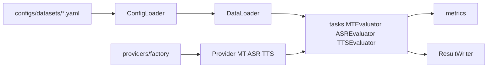

# Architecture

GO AI Bench evaluates **Hugging Face** models on **MT**, **ASR**, and **TTS** using a small, provider-based Python package. Configuration is YAML-driven; results are written as JSON (and optional leaderboard exports).

> [!NOTE]
> This toolkit loads **benchmark data from the Hugging Face Hub** only. Local TSV or custom file-based loaders are out of scope for the current version (see [Roadmap](../../README.md#roadmap) in the main README).

## High-level data flow

1. **ConfigLoader** reads `configs/datasets/<language>.yaml` and resolves the active source plus **benchmark groups** (named split bundles).
2. **DataLoader** calls `datasets.load_dataset` with optional `HF_TOKEN` (see [datasets.md](datasets.md)).
3. **Factory** builds a **provider** from `--model` (e.g. NLLB, Whisper, MMS-TTS).
4. **Evaluators** in `tasks/` run inference through the provider and compute metrics.
5. **ResultWriter** saves per-group JSON, `summary.json`, and optional comparisons / leaderboard.

## Package layout (`src/goai_bench/`)

| Path | Role |
|------|------|
| `cli.py` | Entry point for the `goai-bench` console script; delegates to the benchmark CLI. |
| `core/config_loader.py` | Loads `configs/languages.yaml`, `tasks.yaml`, `domains.yaml`, and per-language dataset YAML. |
| `core/data_loader.py` | HF-only loading for MT / ASR / TTS samples (lists of dicts). |
| `core/evaluator.py` | `run_evaluation()` dispatches to the correct task evaluator (shared by scripts). |
| `core/result_writer.py` | JSON/CSV output, summaries, comparisons, leaderboard append. |
| `core/device.py` | Resolves `cpu` / `cuda` / `mps` / `auto`. |
| `core/model_cache.py` | Process-wide cache for loaded pipelines and weights. |
| `providers/base.py` | Abstract `MTProvider`, `ASRProvider`, `TTSProvider`, `ProviderInfo`. |
| `providers/factory.py` | Maps `model_id` strings to concrete providers. |
| `providers/mt/hf_seq2seq.py` | Seq2seq MT (NLLB, mBART, etc.). |
| `providers/asr/whisper.py` | Whisper via HF `automatic-speech-recognition` pipeline. |
| `providers/asr/wav2vec2.py` | Wav2Vec2 / MMS-CTC direct path. |
| `providers/tts/hf_tts.py` | Generic HF `text-to-speech` pipeline. |
| `providers/tts/mms_tts.py` | MMS-TTS style routing (same pipeline family, explicit backend). |
| `tasks/mt.py`, `asr.py`, `tts.py` | Task-specific evaluation loops and result dataclasses. |
| `metrics/` | chrF++, BLEU, TER, COMET (optional), WER/CER/MER, UTMOS / loopback WER, MCD. |
| `utils/` | Audio I/O, text normalization, Whisper language ids, HF token helper, Rich tables. |
| `visualization/leaderboard.py` | Ranking helpers and normalized scores used by result export. |

> [!IMPORTANT]
> To support a **new model family**, implement the matching abstract provider and extend [`factory.py`](../../src/goai_bench/providers/factory.py). See [providers.md](providers.md).

## Scripts at repository root

| Script | Purpose |
|--------|---------|
| `scripts/run_benchmark.py` | Main Click CLI for a single model run. |
| `scripts/run_baselines.py` | Sweeps a fixed list of baseline models. |
| `scripts/compare_results.py` | Regenerates `comparison.json` / `comparison.md` from existing results. |

## Future architecture improvements

These items are **not required** to use the toolkit but help long-term maintenance:

| Idea | Benefit |
|------|---------|
| Drive `run_baselines.py` from `baseline_models` in `configs/tasks.yaml` | Single source of truth for baseline IDs. |
| Move comparison file generation from `result_writer.py` into e.g. `visualization/comparison.py` | Smaller core module, clearer separation. |
| Decide on `visualization/charts.py` | Either document as an optional plotting extension or remove if unused to slim dependencies. |
| Consistent Google- or NumPy-style docstrings on **public** APIs (`DataLoader`, `run_evaluation`, factory functions) | Easier onboarding for contributors. |

> [!TIP]
> Prefer short module-level descriptions and `Args` / `Returns` on public functions instead of decorative separator lines inside code files.
