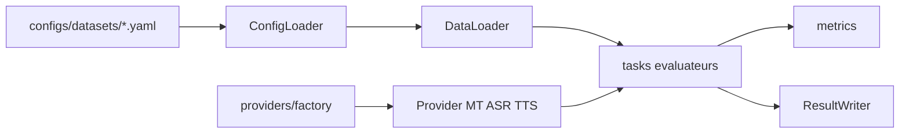

# Architecture

GO AI Bench évalue des modèles **Hugging Face** en **MT**, **ASR** et **TTS** via un package Python modulaire à base de *providers*. La configuration est en YAML ; les résultats sont exportés en JSON (et leaderboard optionnel).

> [!NOTE]
> Les jeux d’évaluation sont chargés **uniquement depuis le Hub Hugging Face**. Les jeux locaux type TSV ne font pas partie de la version actuelle (voir [Roadmap](../../README.md#roadmap) dans le README principal).

## Flux de données

1. **ConfigLoader** lit `configs/datasets/<langue>.yaml` et les **benchmark groups** (regroupements de splits).
2. **DataLoader** appelle `datasets.load_dataset` avec `HF_TOKEN` si besoin.
3. **Factory** instancie un **provider** à partir de `--model`.
4. Les **évaluateurs** dans `tasks/` enchaînent inférence et métriques.
5. **ResultWriter** écrit les JSON par groupe, `summary.json`, comparaisons et leaderboard.

## Arborescence (`src/goai_bench/`)

| Chemin | Rôle |
|--------|------|
| `cli.py` | Point d’entrée de la commande `goai-bench`. |
| `core/config_loader.py` | Chargement des YAML globaux et par langue. |
| `core/data_loader.py` | Chargement HF uniquement (MT / ASR / TTS). |
| `core/evaluator.py` | `run_evaluation()` : dispatch par tâche. |
| `core/result_writer.py` | Sérialisation, résumés, comparaisons, leaderboard. |
| `core/device.py` | Résolution `cpu` / `cuda` / `mps` / `auto`. |
| `core/model_cache.py` | Cache processus des modèles / pipelines. |
| `providers/base.py` | Classes abstraites `MTProvider`, `ASRProvider`, `TTSProvider`. |
| `providers/factory.py` | Routage `model_id` → implémentation concrète. |
| `providers/mt/hf_seq2seq.py` | MT seq2seq (NLLB, etc.). |
| `providers/asr/whisper.py` | Whisper (pipeline HF ASR). |
| `providers/asr/wav2vec2.py` | Wav2Vec2 / MMS-CTC. |
| `providers/tts/hf_tts.py` | Pipeline TTS générique. |
| `providers/tts/mms_tts.py` | Backend MMS-TTS explicite. |
| `tasks/` | Boucles d’évaluation et dataclasses de résultats. |
| `metrics/` | chrF++, BLEU, TER, COMET (optionnel), WER/CER/MER, UTMOS, etc. |
| `utils/` | Audio, texte, token HF, affichage Rich. |
| `visualization/leaderboard.py` | Normalisation et classements pour export. |

> [!IMPORTANT]
> Pour une **nouvelle famille de modèles**, implémenter l’interface adéquate et étendre [`factory.py`](../../src/goai_bench/providers/factory.py). Voir [providers.md](providers.md).

## Scripts

| Script | Usage |
|--------|--------|
| `scripts/run_benchmark.py` | CLI principale pour un modèle. |
| `scripts/run_baselines.py` | Balayage de modèles de référence. |
| `scripts/compare_results.py` | Régénère `comparison.json` / `.md`. |

## Évolutions d’architecture possibles

| Piste | Intérêt |
|-------|---------|
| Piloter `run_baselines.py` depuis `baseline_models` dans `configs/tasks.yaml` | Une seule source de vérité. |
| Extraire la génération de comparaisons de `result_writer.py` vers p.ex. `visualization/comparison.py` | Modules plus courts. |
| Statut de `visualization/charts.py` | Documenter comme extension optionnelle ou retirer si inutilisé. |
| Docstrings uniformes (style Google/NumPy) sur l’API publique | Meilleure lisibilité pour les contributeurs. |

> [!TIP]
> Privilégier de courtes descriptions en tête de module et des docstrings `Args` / `Returns` sur les fonctions publiques plutôt que de longs séparateurs dans le code.
